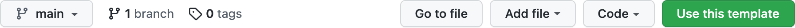
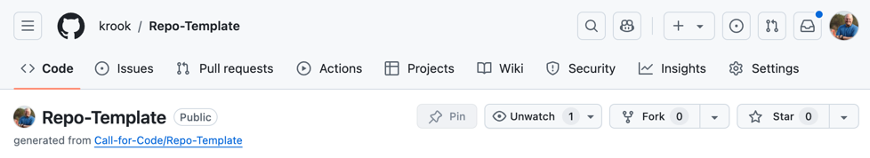

# Beginner's Open Source Workshop (for Students)

 

Simple lab for students to start to use GitHub and submit their first pull request.

- [Create a GitHub account](#create-a-github-account)
- [Exercise 1: Create your first pull request](#exercise-1-create-your-first-pull-request)
- [Exercise 2: Create your first repo from a template](#exercise-2-create-your-first-repo-from-a-template)
- [Exercise 3: Create a website from a repo](#exercise-3-create-a-website-from-a-repo)
- [Next steps](#next-steps)

## Create a GitHub account

Go ahead and [sign up for a public GitHub account](https://github.com/signup).

## Exercise 1: Create your first pull request

With that done, it's now time to create your first GitHub contribution! Follow the steps in the [**Practice-Pull-Requests**](https://github.com/Call-for-Code/Practice-Pull-Requests) repo.

## Exercise 2: Create your first repo from a template

Ok, now that you've learned how to contribute to an existing project, it's time to create and configure your own repository from the [**Repo Template**](https://github.com/Call-for-Code/Repo-Template).

First, click the green "Use this template" button at the top of the repo. Create a copy under your GitHub user name. You can make it public or private if you want to work on something before releasing it later.

This repo is a bit more complex than the pull reqest practices repo, but you'll notice that it has the same key `README.md`, `CONTRIBUTING.md`, and `LICENSE` files as you saw there.

From here, you'll want to get familiar with 4 of the tabs at the top of your repo. You've already worked with issues and pull requests. Let's ignore ZenHub (if you have it) and Actions for now and focus on **Projects**, **Wiki**, **Security**, **Insights**, and **Settings**.

### Projects

This is GitHub's built in project management feature for tracking issues on a board. It can be used similar to Trello or ZenHub. This is a good way to manage your wall of work and track progress during standups or scrums. You can create projects at the repo level, or manage tasks in many repos by using one at the organization level.

### Wiki

This is an alternative to providing your documentation alongside what's in the Code part of the repo. There are pros and cons to this, as folks may not know you have a wiki unless you explicitly point to it from your `README.md`. For a good example of how wikis are used alongside code, have a look at the **ClusterDuck Protocol** [**README.md**](https://github.com/Call-for-Code/ClusterDuck-Protocol) and [**wiki**](https://github.com/Call-for-Code/ClusterDuck-Protocol/wiki).

### Security

Here you can review how security issues are handles. There are some options you can check, and you'll quickly become familar with the GitHub [**dependabot**](https://github.com/dependabot) which will scan public repos for dependency vulnerabilities and often send you pull requests. If you're building a Node.js app, dependabot will be your new best friend.

### Insights

This tab serves as your metrics dashboard. You can see how your code is being updated over time, who your leading contributors are, and how many people are finding your repo from various links.

### Settings

Finally, this tab contains just about every other configuration for your project. You can manage user permissions here and invite others to collaborate on your project. One other interesting item is Pages. This allows you to publish a public website from your repository. So if you're looking for free webhosting (you can even point a custom domain at it) this could be interesting. This is used to host [**pyrrha-platform.org**](https://github.com/Pyrrha-Platform/Pyrrha-Website). We'll show you how to create your own website in the next exercise.

## Exercise 3: Create a website from a repo

For this exercise, you'll follow the steps in the [Quickstart for GitHub Pages documentation](https://docs.github.com/en/pages/quickstart).

> You can use GitHub Pages to showcase some open source projects, host a blog, or even share your résumé. This guide will help get you started on creating your next website.

## Next steps

After you've gotten the hang of things through this workshop repository, we encourage you to continue learning more about contributing to open source.

1. Spend 4-6 hours on the [**free "Introduction to Open Source" class**](https://cognitiveclass.ai/courses/introduction-to-open-source). It's intended for technical and non-technical folks alike to learn about open source, which is becoming a key skill in today's world. You can earn a badge and certificate after completion.

1. And/or you can spend about 7-10 hours on the [**free "A Beginner’s Guide to Open Source Software Development" training course**](https://training.linuxfoundation.org/training/beginners-guide-open-source-software-development/) from the Linux Foundation. 

1. Explore the existing [**Call for Code projects**](https://github.com/Call-for-Code/Project-Catalog) and make your first contribution! Anything from a small typo fix, to a language translation or documentation update, to an important code fix is welcome!
